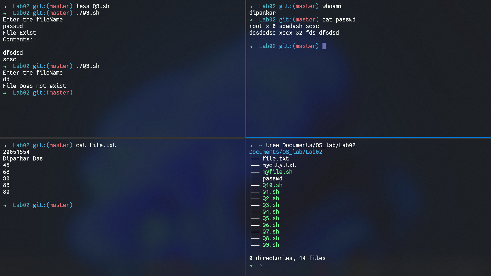

# OS Lab01
`Author: Dipankar Das`

`Date: 5-2-2022`

`Roll: 20051554`

## Question 1


### Solution
```bash
#!/bin/sh

echo "Enter your name"

read name

echo "Entered name: $name"
```
### Output


## Question 2


## Solution
```bash
#!/bin/sh

a=$1
b=$2

res=`echo $a *\ $b | bc`
echo "Res: $res"
```
## Output


## Question 3


## Solution
```bash
#!/bin/sh

echo "Enter a number"

read num

if [ `expr $num % 2` -eq 0 ]
then
	echo "Even number"
else
	echo "Odd number"
fi
```
## Output


## Question 4


## Solution
```bash
#!/bin/sh

echo "Enter 3 number"

read a
read b
read c

if [ $a -lt $b ]
then
	if [ $a -lt $c ]
	then
		echo "smallest: $a"
	else
		echo "smallest: $c"
	fi

else
	if [ $b -lt $c ]
	then
		echo "smallest: $b"
	else
		echo "smallest: $c"
	fi
fi

if [ $a -gt $b ]
then
	if [ $a -gt $c ]
	then
		echo "largest: $a"
	else
		echo "largest: $c"
	fi

else
	if [ $b -gt $c ]
	then
		echo "largest: $b"
	else
		echo "largest: $c"
	fi
fi
```
## Output


## Question 5


## Solution
```bash
#!/bin/sh

echo "enter the username"

read usr

currUsr=$(whoami)

if [ "$usr" = "$currUsr" ]
then
	echo "Currently logged in"
else
	echo "Currently not logged in"
fi
```
## Output


## Question 6


## Solution
```bash
#!/bin/bash

currHour=$(date +%H)
currDate=$(date +%x)
currTime=$(date +%X)

if [ "$currHour" -lt "12" ]; then
	echo "Good Morning"

elif [ "$currHour" -ge "12" -a "$currHour" -le "18" ]; then
	echo "Good Afternoon"

else
	echo "Good Night"
fi

echo "It's $currTime of $currDate"
```
## Output


## Question 7


## Solution
```bash
#!/bin/bash

echo "Enter the marks for a subject"

read marks

if [ $marks -ge 90 ]; then
	echo "Grade: 'O'"
elif [ $marks -ge 80 ]; then
	echo "Grade: 'A'"
elif [ $marks -ge 70 ]; then
	echo "Grade: 'B'"
elif [ $marks -ge 60 ]; then
	echo "Grade: 'C'"
elif [ $marks -ge 50 ]; then
	echo "Grade: 'D'"
elif [ $marks -ge 40 ]; then
	echo "Grade: 'E'"
else
	echo "Grade: 'F'"
fi
```
## Output


## Question 8


## Solution
```bash
#!/bin/bash

# marks=$(sed -ne 3,7p file.txt)
# echo "$marks"

m1=$(sed -ne '3,3p' file.txt)
m2=$(sed -ne '4,4p' file.txt)
m3=$(sed -ne '5,5p' file.txt)
m4=$(sed -ne '6,6p' file.txt)
m5=$(sed -ne '7,7p' file.txt)

echo "Hello, $(sed -ne '1,2p' file.txt)"

total=`expr $m1 + $m2 + $m3 + $m4 + $m5`
per=`echo $total \/ 5 | bc -l`
echo "Total: $total"
echo "Percentage: $per%"
```
## Output


## Question 9


## Solution
```bash
#!/bin/bash

echo "Enter the fileName"

read fname

if [ -f "$fname" ]; then
	echo "File Exist"
	echo "Contents:"
	txt=`cut -d " " -f 5 $fname | sort`
	echo "$txt"

else
	echo "File Does not exist"
fi
```
## Output



## Question 10


## Solution
```bash
#!/bin/bash

echo "Enter [ 1 ] List files"
echo "Enter [ 2 ] create dir"
echo "Enter [ 3 ] change dir"
echo "Enter [ 4 ] remove dir"
echo "Enter [ 5 ] create file"
echo "Enter [ 6 ] copy file"
echo "Enter [ 7 ] remove file"

read choice

if [ $choice -eq 1 ]; then
# assuming it is the curr dir
	ls -la

elif [ $choice -eq 2 ]; then
	echo "Enter the directory name"
	read dirN
	`mkdir $dirN`
	ls -la

elif [ $choice -eq 3 ]; then
	echo "Enter the directory name"
	read dirN
	cd $dirN
	pwd

elif [ $choice -eq 4 ]; then
	echo "Enter the directory name"
	read dirN
	`rm -Ri $dirN`
	ls -la

elif [ $choice -eq 5 ]; then
	echo "Enter the file name"
	read fileN
	`touch $fileN`		
	ls -l

elif [ $choice -eq 6 ]; then
	echo "Enter the file name"
	read fileN
	`cp -v $fileN copy_$fileN`
	ls -l
elif [ $choice -eq 7 ]; then
	echo "Enter the file name"
	read fileN
	`rm -i $fileN`
	ls -l
else
	echo "Wrong Choice"
fi
```
## Output


