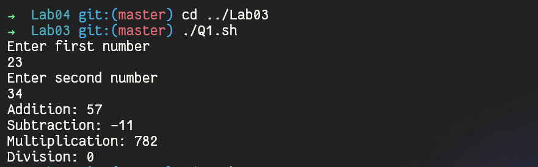
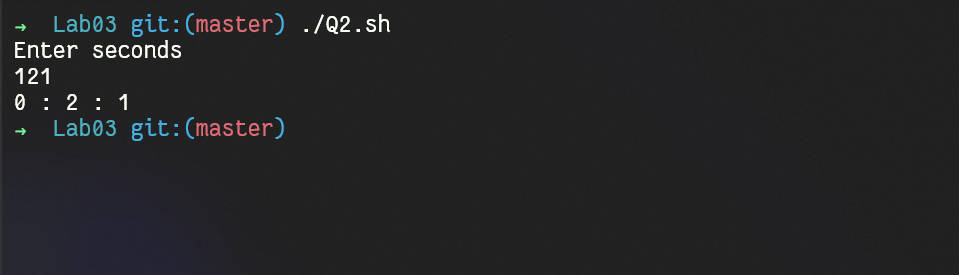
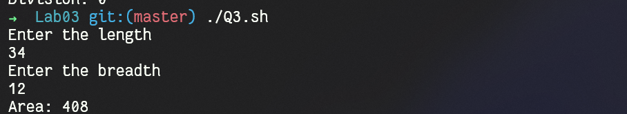
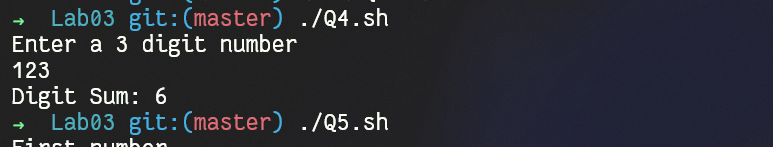
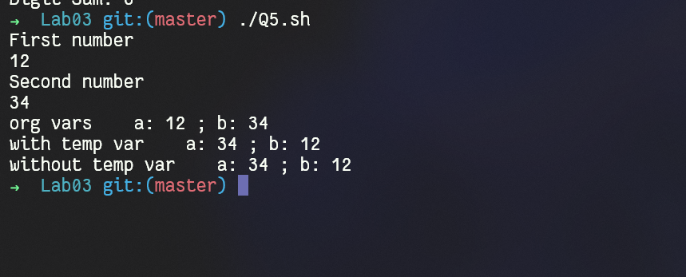

# OS Lab02
`Author: Dipankar Das`

`Date: 10-2-2022`

`Roll: 20051554`

## Question 1
Write a shell script to input two integer numbers and perform all its arithmetic operations

### Solution
```bash
#!/bin/bash

echo "Enter first number"
read A

echo "Enter second number"
read B

# addition
resA=`echo $A + $B | bc`

# subtraction
resS=`echo $A - $B | bc`


# multiplication
resM=`echo $A \* $B | bc`

# division
resD=`echo $A \/ $B | bc`

echo "Addition: $resA"
echo "Subtraction: $resS"
echo "Multiplication: $resM"
echo "Division: $resD"
```
### Output



## Question 2
Program write a shell script to input time in seconds and find out how many hours and minutes and seconds are there

### Solution
```bash
#!/bin/bash

echo "Enter seconds"
read seconds

hrs=`expr $seconds \/ 3600`

seconds=`expr $seconds \% 3600`

mins=`expr $seconds \/ 60`

seconds=`expr $seconds \% 60`


echo "$hrs : $mins : $seconds"
```
### Output


## Question 3
Write a shell script to input two sides of rectangle and find out its area

### Solution
```bash
#!/bin/bash

echo "Enter the length"

read L

echo "Enter the breadth"

read B

area=`echo $L \* $B | bc`

echo "Area: $area"
```
### Output


## Question 4
Write a shell script to input a 3 digit number and find out the sum of all the digits

### Solution
```bash
#!/bin/bash

# assuming 3 digit number
echo "Enter a 3 digit number"

read number

sum=0

digit=`expr $number \% 10`
sum=`expr $sum + $digit`
number=`expr $number / 10`


digit=`expr $number \% 10`
sum=`expr $sum + $digit`
number=`expr $number \/ 10`


digit=`expr $number \% 10`
sum=`expr $sum + $digit`
number=`expr $number \/ 10`


echo "Digit Sum: $sum"
```
### Output


## Question 5
Write a shell script to import a 2 numbers and swap them
1. using third variable
2. without using third variable

### Solution
```bash
#!/bin/bash


echo "First number"
read a

echo "Second number"
read b

orgA=$a
orgB=$b

echo "org vars    a: $a ; b: $b"

t=$a
a=$b
b=$t

echo "with temp var    a: $a ; b: $b"

# no extra var

orgB=`expr $orgA + $orgB`
orgA=`expr $orgB - $orgA`
orgB=`expr $orgB - $orgA`

echo "without temp var    a: $orgA ; b: $orgB"
```
### Output
