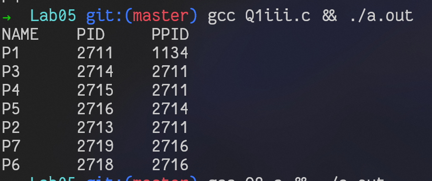

# OS Lab04
`Author: Dipankar Das`

`Date: 3-2-2022`

`Roll: 20051554`

## Question 1
Write a program to create the following process tree

## Question 1 (i)
```
  P1
 / | \
P2 P3 P4
```
### Solution
```CPP
#include <stdio.h>
#include <stdlib.h>
#include <unistd.h>
#include <sys/types.h>
#include <sys/wait.h>

int main(int argc, char **argv) {
  printf("P1\n");
  for (int i = 1; i < 4; i++)
  {
    pid_t t = fork();
    if (t == 0) {
      printf("P%d\n", i+1);
      exit(0);
    }
  }

  wait(NULL);
  remove(argv[0]);
  return EXIT_SUCCESS;
}
```
### Output


## Question 1 (ii)
```
	P1
	|
	P2
	|
	P3
	|
	P4
```

### Solution

```CPP
#include <stdio.h>
#include <stdlib.h>
#include <unistd.h>
#include <sys/types.h>
#include <assert.h>
#include <sys/wait.h>

int main(int argc, char **argv) {
  printf("NAME\tPID\tPPID\n");
  for (int i = 0; i < 4; i++) {
    printf("P%d\t%d\t%d\n",i+1, getpid(), getppid());
    pid_t t = fork();
    assert(t >= 0);
    if (t != 0)
      break;
  }

  wait(NULL);
  remove(argv[0]);
  return EXIT_SUCCESS;
}

```
### Output


## Question 1 (iii)
```
   P1
  / | \
 P2 P3 P4
	 |
	 P5
	/  \
   P6  P7
```

### Solution
```CPP
#include <stdio.h>
#include <stdlib.h>
#include <unistd.h>
#include <sys/types.h>
#include <assert.h>
#include <sys/wait.h>

int main(int argc, char **argv)
{
  pid_t t = 0;
  printf("NAME\tPID\tPPID\n");
  printf("P1\t%d\t%d\n", getpid(), getppid());
  for (int i = 1; i <= 4; i++)
  {
    t = fork();
    assert(t >= 0);

    if (t == 0) {
      if (i != 1)
        printf("P%d\t%d\t%d\n", i, getpid(), getppid());
      if (i == 3) {
        pid_t tt = fork();
        if (tt == 0) {
          printf("P5\t%d\t%d\n", getpid(), getppid());
          for (int i = 6; i < 8; i++) {
            pid_t tt = fork();
            if (tt == 0) {
              printf("P%d\t%d\t%d\n", i, getpid(), getppid());
              exit(0);
            }
          }
          wait(NULL);
        }
      }
      break;
    }
  }

  wait(NULL);
  remove(argv[0]);
  return EXIT_SUCCESS;
}

```
### Output



## Question 2

Write a C program that will create any given process tree with the following information for each process i.e. level number, index number and the number of children
example
```
          P1 {0,0,2}
         / \
{1,0,0} P2  P3 {1,1,2}
           /  \
  {2,0,0} P4  P5 {2,1,1}
              |
             P6 {3,0,0}
```
### Solution
```CPP
/**
 * @Assumption 
 *    that there are 6 processes
 *    input is given in sorted order i.e. inorder traversal
 * @input
 * 0 0 2
 * 1 0 0
 * 1 1 2
 * 2 0 0
 * 2 1 1
 * 3 0 0
 * @example
 *           P1 {0,0,2}
 *          / \
 * {1,0,0} P2  P3 {1,1,2}
 *            /  \
 *   {2,0,0} P4  P5 {2,1,1}
 *               |
 *              P6 {3,0,0}
 */
#include <stdio.h>
#include <stdlib.h>
#include <unistd.h>
#include <sys/types.h>
#include <sys/wait.h>
#define NOPROC 6

struct procContent{
  int level, idx, children;
};

struct procContent proc[NOPROC];

void createProcess(int index) {
  int nChild = proc[index].children;
  printf("P%d\t%d\t%d\n", index+1, getpid(), getppid());

  for (int i = 1; i <= nChild; i++) {
    pid_t t = fork();
    if (t == 0) {
      createProcess(index + i);
      break;
    }
  }
  wait(NULL);
}

int main(int argc, char **argv)
{
  printf("Enter the levelno, indexNO, number of children\n");
  for (int i = 0; i < NOPROC; i++) {
    scanf("%d %d %d", &proc[i].level, &proc[i].idx, &proc[i].children);
  }

  printf("Process\tPID\tPPID\n");
  createProcess(0);

  wait(NULL);
  remove(argv[0]);
  return EXIT_SUCCESS;
}
```
### Output


