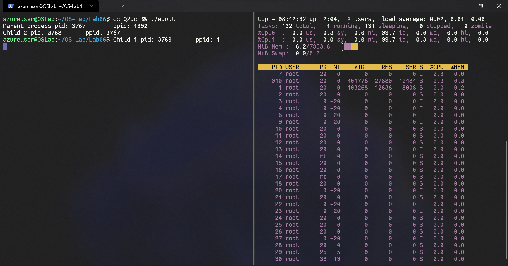

# OS Lab05
`Author: Dipankar Das`

`Date: 17-3-2022`

`Roll: 20051554`

## Question 1
Write a C program where the parent process has to wait till the completion of all the child processes so that no child processes will become orphan

### Solution
```CPP

#include <stdio.h>
#include <sys/wait.h>
#include <unistd.h>
#include <stdlib.h>
#include <sys/types.h>
#include <assert.h>

int main(int argc, char *argv[]) {
	int N;
	printf("Enter the number of child processes to be created: ");
	scanf("%d",&N);
	pid_t t = 0;

	for (int i = 0; i<N;i++) {
		t = fork();
		assert(t >= 0);
		if (t == 0) {
			printf("Child Process pid: %d\tppid: %d\n",getpid(), getppid());
			exit(0);
		} else {
			printf("Parent Process pid: %d\tppid: %d\n",getpid(), getppid());
			//wait(NULL);
		}
	}
	while (wait(NULL) != -1);
	remove(argv[0]);
	return 0;
}

```
### Output


## Question 2
Create two child processes C1 and C2 make sure that only C1 becomes an orphan process

### Solution

```CPP
#include <stdio.h>
#include <stdlib.h>
#include <unistd.h>
#include <sys/wait.h>
#include <sys/types.h>
#include <assert.h>

int main(int argc, char *argv[])
{
	pid_t t = 0;
	printf("Parent process pid: %d\tppid: %d\n", getpid(), getppid());

	t = fork();

	if (t == 0) {
		printf("Child 2 pid: %d\tppid: %d\n", getpid(), getppid());
		exit(0);
	}
	
	while (wait(NULL) != -1);
	

	t = fork();
	if (t > 0)
		exit(0);
		
	sleep(1);
	printf("Child 1 pid: %d\tppid: %d\n", getpid(), getppid());
	

	return 0;
}
```
### Output



## Question 3
Create a scenario where a parent has two child C1 & C2 ,such that C1 becomes a zombie while C2 becomes an orphan process

### Solution

```CPP
#include <stdio.h>
#include <stdlib.h>
#include <unistd.h>
#include <sys/wait.h>
#include <sys/types.h>
#include <assert.h>

int main(int argc, char *argv[])
{
	for (int i = 1; i <= 2; i++) {
		pid_t t = fork();
		
		assert(t >= 0);

		if ( i == 1 ) {
			if (t > 0) {
				sleep(2);
				printf("Parent process pid:%d\tppid:%d\n", getpid(), getppid());
				wait(NULL);
			}else{
				printf("Child process pid: %d\tppid: %d\n", getpid(), getppid());
				exit(0);
			}
		}else {
			system("ps -To pid,ppid,stat,cmd");
			if (t > 0) {
				sleep(0.2);
				printf("Parent process pid:%d\tppid:%d\n", getpid(), getppid());
			} else {
				sleep(1);
				printf("Child process pid: %d\tppid: %d\n", getpid(), getppid());
			}
		}
	}
	return 0;
}

```

### Output


