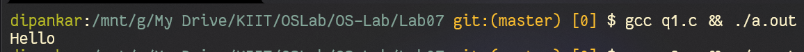
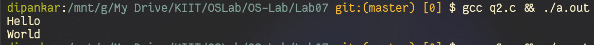
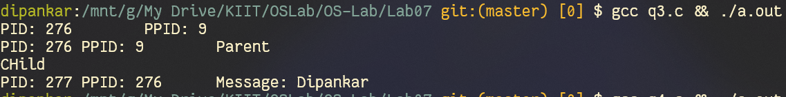
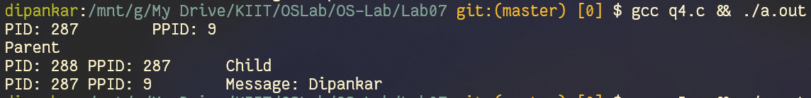
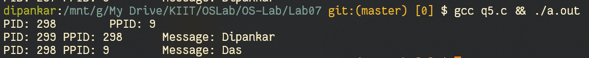

# OS Lab06
`Author: Dipankar Das`

`Date: 31-3-2022`

`Roll: 20051554`

## Question 1


### Solution
```CPP
#include <stdio.h>
#include <stdlib.h>
#include <assert.h>
#include <unistd.h>

int main() {
  int fd[2];
  char message[10] = {0};
  assert(pipe(fd) == 0);
  write (fd[1], "Hello", 5);
  read(fd[0], &message, 5);
  printf("%s\n", message);
}
```
### Output



## Question 2

### Solution

```CPP
#include <stdio.h>
#include <stdlib.h>
#include <assert.h>
#include <unistd.h>

int main() {
  int fd[2];
  char message[10] = {0};
  assert(pipe(fd) == 0);
  write (fd[1], "Hello", 5);
  read(fd[0], &message, 5);
  printf("%s\n", message);

  write(fd[1], "World", 5);
  read(fd[0], &message, 5);
  printf("%s\n", message);
}
```
### Output



## Question 3

### Solution

```CPP
#include <stdio.h>
#include <stdlib.h>
#include <assert.h>
#include <sys/types.h>
#include <sys/wait.h>
#include <unistd.h>

int main() {
  printf("PID: %d\tPPID: %d\n",getpid(), getppid());
  int fd[2];
  char message[10] = {0};
  assert(pipe(fd) == 0);

  pid_t id = fork();
  assert(id >= 0);
  if (id > 0) {
    // parent
    close(fd[0]);
    printf("PID: %d PPID: %d\tParent\n", getpid(), getppid());
    write(fd[1], "Dipankar", 8);
    wait(NULL);
  } else {
    close(fd[1]);
    printf("CHild\n");
    read(fd[0], &message, 10);
    printf("PID: %d PPID: %d\tMessage: %s\n", getpid(), getppid(), message);
  }
  return 0;
}
```

### Output



## Question 4

### Solution

```CPP
#include <stdio.h>
#include <stdlib.h>
#include <assert.h>
#include <sys/types.h>
#include <sys/wait.h>
#include <unistd.h>

int main() {
  printf("PID: %d\tPPID: %d\n",getpid(), getppid());
  int fd[2];
  char message[10] = {0};
  assert(pipe(fd) == 0);

  pid_t id = fork();
  assert(id >= 0);
  if (id > 0) {
    // parent
    close(fd[1]);
    printf("Parent\n");
    read(fd[0], &message, 10);
    printf("PID: %d PPID: %d\tMessage: %s\n", getpid(), getppid(), message);
    wait(NULL);
  } else {
    close(fd[0]);
    printf("PID: %d PPID: %d\tChild\n", getpid(), getppid());
    write(fd[1], "Dipankar", 8);
  }
  return 0;
}
```

### Output


## Question 5


### Solution
```CPP
#include <stdio.h>
#include <stdlib.h>
#include <assert.h>
#include <sys/types.h>
#include <sys/wait.h>
#include <unistd.h>

int main() {
  printf("PID: %d\tPPID: %d\n",getpid(), getppid());
  int fd1[2];
  int fd2[2];
  char message[10] = {0};
  assert(pipe(fd1) == 0);
  assert(pipe(fd2) == 0);

  pid_t id = fork();
  assert(id >= 0);
  if (id > 0) {
    // parent
    close(fd1[0]);
    write(fd1[1], "Dipankar", 8);


    wait(NULL);

    close(fd2[1]);
    read(fd2[0], message, 10);
    printf("PID: %d PPID: %d\tMessage: %s\n", getpid(), getppid(), message);

  } else {

    close(fd1[1]);
    read(fd1[0], message, 10);
    printf("PID: %d PPID: %d\tMessage: %s\n", getpid(), getppid(), message);

    // second message
    write(fd2[1], "Das", 3);
  }
  return 0;
}
```
### Output

