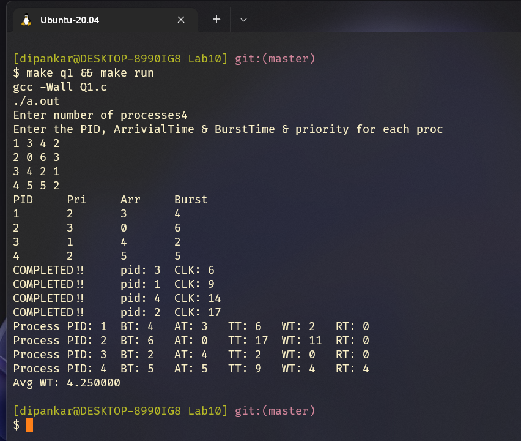
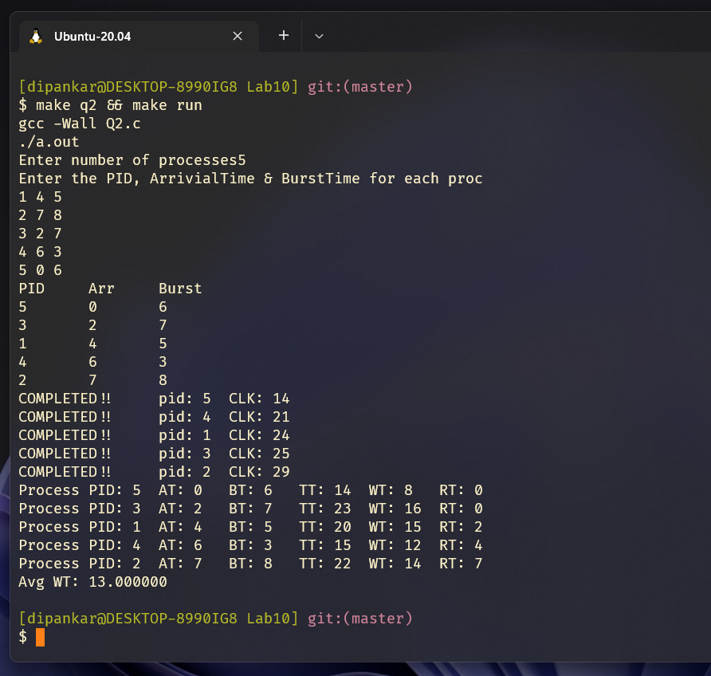

# OS Lab08
`Author: Dipankar Das`

`Date: 29-4-2022`

`Roll: 20051554`

[Github Link](https://github.com/dipankardas011/OS-Lab)

## Question 1
Write a program in C to implement Priority CPU scheduling (preemptive)(o/p-response time, turnaround time , waiting time, average waiting time.)

## Solution
### timer.h
```cpp
#ifndef STDIO_H
#include <stdio.h>
#endif

size_t CLK_CYCLE;
```

### proc.h
```cpp
#ifndef STDLIB_H
#include <stdlib.h>
#endif

enum state {
  RUNNING,
  RUNNABLE,
  TERMINATED,
  EMBRYO
};


struct proc {
  int pid;
  int arrTime;
  int burstTime;
  enum state currState;
  int initStartTime;
  int finalEndTime;
  int priority;
};

struct proc* Rqueue = NULL;
int *tempStoreBT = NULL;

```

### Q1.c
```cpp
#include <stdbool.h>
#include "proc.h"
#include "timer.h"

#ifndef STDIO_H
#include <stdio.h>
#endif
#ifndef STDLIB_H
#include <stdlib.h>
#endif


int NoOfProcesses;

void enterData() {
  printf("Enter the PID, ArrivialTime & BurstTime & priority for each proc\n");
  int id, bt, at, pri;
  for (int i = 0; i < NoOfProcesses; i++)
  {
    scanf("%d %d %d %d", &id, &at, &bt, &pri);
    Rqueue[i].arrTime = at;
    Rqueue[i].burstTime = bt;
    Rqueue[i].currState = EMBRYO;
    Rqueue[i].pid = id;
    Rqueue[i].priority = pri;
    Rqueue[i].initStartTime = Rqueue[i].finalEndTime = 0;
    tempStoreBT[i] = bt;
  }
}

void __PS() {
  printf("PID\tPri\tArr\tBurst\n");
  for (int i = 0; i < NoOfProcesses; i++)
    printf("%d\t%d\t%d\t%d\n", Rqueue[i].pid, Rqueue[i].priority, Rqueue[i].arrTime, Rqueue[i].burstTime);
}

void sched() {
  for (int i = 0; i < NoOfProcesses; i++) {
    if (CLK_CYCLE >= Rqueue[i].arrTime 
        && Rqueue[i].currState == EMBRYO) {

      int minBT = i;
      for (int j = 0; j < NoOfProcesses; j++) {

        if (Rqueue[j].currState == EMBRYO
            && CLK_CYCLE >= Rqueue[j].arrTime 
            && Rqueue[j].priority < Rqueue[minBT].priority)

              minBT = j;
        if (Rqueue[j].currState == EMBRYO
            && CLK_CYCLE >= Rqueue[j].arrTime 
            && Rqueue[j].priority == Rqueue[minBT].priority
            && Rqueue[j].arrTime < Rqueue[minBT].arrTime)
              
              minBT = j;
      }
      i = minBT;
      Rqueue[i].currState = RUNNABLE;
      // it is not always gaurantee that once the program get its RUNNABLE it it loaded on CPU
      // Rqueue[i].initStartTime = CLK_CYCLE;
      return;
    }
  }
}

int isAllDone() {
  for (int i = 0; i < NoOfProcesses; i++) {
    if (Rqueue[i].currState != TERMINATED)
      return 0;
  }
  return 1;
}

void __CPU_SCHED(int idx) {
  Rqueue[idx].currState = RUNNING;
  int BT = Rqueue[idx].burstTime;
  // if the process starts its exquition for the first time it saves it
  if (BT == tempStoreBT[idx]) {
    Rqueue[idx].initStartTime = CLK_CYCLE;
  }
  bool flag = true;
  while (BT > 0 && flag) {
    CLK_CYCLE++;
    BT--;
    flag = false; // ensuring that cpu runs for only one clk so that we can check continuously 
    // for the new arrivial process
  }
  Rqueue[idx].burstTime = BT;
  if (BT == 0) {
    Rqueue[idx].finalEndTime = CLK_CYCLE;
    Rqueue[idx].currState = TERMINATED;
    printf("COMPLETED!!\tpid: %d\tCLK: %ld\n", Rqueue[idx].pid, CLK_CYCLE);
    return;
  }
  Rqueue[idx].currState = RUNNABLE;
  // record the Complition time for a process
}

// returns the index for that process to run
void proc() {
  while (1) {
    // check if all have done
    if (isAllDone() == 1)
      return;

    int i;

    for (i = 0; i < NoOfProcesses; i++) {
      if (Rqueue[i].currState == RUNNABLE) {

        // find the minBT process
        int minBT = i;
        for (int j = 0; j < NoOfProcesses; j++) {
          if (Rqueue[j].currState == RUNNABLE && 
                Rqueue[minBT].priority > Rqueue[j].priority)
              minBT = j;
          if (Rqueue[j].currState == RUNNABLE && 
                Rqueue[minBT].priority == Rqueue[j].priority &&
                Rqueue[minBT].arrTime > Rqueue[j].arrTime)
              minBT = j;
        }

        i = minBT;
        __CPU_SCHED(i);

        break;
      }
      
    }
    if (i == NoOfProcesses) {
      // no process was found
      CLK_CYCLE++;
    }
    // when a process gets completed the scheduler is called
    sched();
  }
}

void ReportDis() {
  int Swt = 0;
  for (int i = 0; i < NoOfProcesses; i++)
  {
    int TT = Rqueue[i].finalEndTime - Rqueue[i].arrTime;
    int RT = Rqueue[i].initStartTime - Rqueue[i].arrTime;
    int WT = TT - tempStoreBT[i];
    Swt += WT;
    printf("Process\tPID: %d\tBT: %d\tAT: %d\tTT: %d\tWT: %d\tRT: %d\n",
           Rqueue[i].pid, tempStoreBT[i], Rqueue[i].arrTime, TT, WT, RT);
  }
  printf("Avg WT: %f\n", (float)(Swt)/NoOfProcesses);
}

int main() {
  CLK_CYCLE = 0;
  printf("Enter number of processes");
  scanf("%d", &NoOfProcesses);
  Rqueue = (struct proc *)malloc(sizeof(struct proc) * NoOfProcesses);
  tempStoreBT = (int *)malloc(sizeof(int) * NoOfProcesses);
  enterData();
  __PS();
  // initial scheduler is called so as to make the process as runnable
  sched();
  proc();

  // all have done display Report
  ReportDis();

  free(Rqueue);
  free(tempStoreBT);
  return 0;
}
```

## Output



## Question 2
Write a program in C to implement Round Robin CPU scheduling(o/p-response time, turnaround time , waiting time, average waiting time.)

## Solution
### timer.h
```cpp
#ifndef STDIO_H
#include <stdio.h>
#endif

size_t CLK_CYCLE;
```

### procRR.h
```cpp
#ifndef STDLIB_H
#include <stdlib.h>
#endif
#define SIZE 2

enum state {
  RUNNING,
  RUNNABLE,
  TERMINATED,
  EMBRYO
};


struct proc {
  int pid;
  int arrTime;
  int burstTime;
  enum state currState;
  int initStartTime;
  int finalEndTime;
};

struct proc* Rqueue = NULL;
int *tempStoreBT = NULL;

struct readyQueue {
  int frontIdx;
  int rearIdx;
  int arr[SIZE];
};

struct readyQueue RQ;

void initRQ() {
  RQ.frontIdx = RQ.rearIdx = -1;
}

int isEmptyRQ() {
  if (RQ.frontIdx == -1 && RQ.rearIdx == -1)
    return 1;
  return 0;
}

/**
 * @return status if 1 successful otherwise failure
 */
int pushRQ(int pid) {
  if (isEmptyRQ()) {
    RQ.frontIdx = 0;
    RQ.arr[(RQ.rearIdx + 1) % SIZE] = pid;
    RQ.rearIdx = (RQ.rearIdx + 1) % SIZE;
    return 1;
  }
  if ((RQ.rearIdx + 1)%SIZE == RQ.frontIdx)
    return 0;
  else {
    RQ.arr[(RQ.rearIdx + 1) % SIZE] = pid;
    RQ.rearIdx = (RQ.rearIdx + 1) % SIZE;
    return 1;
  }
}

/**
 * @return will return process PID to be worked on
 */
int popRQ() {
  if (isEmptyRQ()) {
    return -999;
  }
  int pid = RQ.arr[RQ.frontIdx];
  if (RQ.frontIdx == RQ.rearIdx) {
    // only one element
    RQ.frontIdx = RQ.rearIdx = -1;
  } else {
    RQ.frontIdx = (RQ.frontIdx + 1) % SIZE;
  }
  return pid;
}
```

### Q2.c
```cpp
#include <stdbool.h>
#include "procRR.h"
#include "timer.h"

#ifndef STDIO_H
#include <stdio.h>
#endif
#ifndef STDLIB_H
#include <stdlib.h>
#endif

static int Qt = 2; // 3 Qt

int NoOfProcesses;

void enterData() {
  printf("Enter the PID, ArrivialTime & BurstTime for each proc\n");
  int id, bt, at;
  for (int i = 0; i < NoOfProcesses; i++)
  {
    scanf("%d %d %d", &id, &at, &bt);
    Rqueue[i].arrTime = at;
    Rqueue[i].burstTime = bt;
    Rqueue[i].currState = EMBRYO;
    Rqueue[i].pid = id;
    Rqueue[i].initStartTime = Rqueue[i].finalEndTime = 0;
    tempStoreBT[i] = bt;
  }
}

void __PS() {
  printf("PID\tArr\tBurst\n");
  for (int i = 0; i < NoOfProcesses; i++)
    printf("%d\t%d\t%d\n", Rqueue[i].pid, Rqueue[i].arrTime, Rqueue[i].burstTime);
}

void sched() {
  for (int i = 0; i < NoOfProcesses; i++) {
    if (CLK_CYCLE >= Rqueue[i].arrTime 
        && Rqueue[i].currState == EMBRYO) {

      
      Rqueue[i].currState = RUNNABLE;
      int ret = pushRQ(i);
      if (!ret) {
        system("echo \"$(tput setaf 2)$(tput bold)UNKNOWN: $(tput init)Resource leak or INF loop\"");
        while (1){
          printf("1001");
        } // ♾️ loop
      }
    }
  }
}

/**
 * @def in real time OS the process are added as they come
 * be default it comes in inc time order only
 */
void sortAccToArrTime() {
  for (int i = 0; i < NoOfProcesses; i++) {
    for (int j = 0; j < NoOfProcesses - i - 1; j++) {
      if (Rqueue[j].arrTime > Rqueue[j + 1].arrTime) {
        struct proc T;
        int temp;
        T.arrTime       = Rqueue[j].arrTime;
        T.currState     = Rqueue[j].currState;
        T.pid           = Rqueue[j].pid;
        T.initStartTime = Rqueue[j].initStartTime;
        T.finalEndTime  = Rqueue[j].finalEndTime;
        T.burstTime     = Rqueue[j].burstTime;
        temp            = tempStoreBT[j];

        Rqueue[j].arrTime       = Rqueue[j + 1].arrTime;
        Rqueue[j].currState     = Rqueue[j + 1].currState;
        Rqueue[j].pid           = Rqueue[j + 1].pid;
        Rqueue[j].burstTime     = Rqueue[j + 1].burstTime;
        Rqueue[j].initStartTime = Rqueue[j + 1].initStartTime;
        Rqueue[j].finalEndTime  = Rqueue[j + 1].finalEndTime;
        tempStoreBT[j]          = tempStoreBT[j + 1];

        Rqueue[j + 1].arrTime       = T.arrTime;
        Rqueue[j + 1].currState     = T.currState;
        Rqueue[j + 1].pid           = T.pid;
        Rqueue[j + 1].burstTime     = T.burstTime;
        Rqueue[j + 1].initStartTime = T.initStartTime;
        Rqueue[j + 1].finalEndTime  = T.finalEndTime;
        tempStoreBT[j + 1]          = temp;
      }
    }
  }
}

int isAllDone() {
  for (int i = 0; i < NoOfProcesses; i++) {
    if (Rqueue[i].currState != TERMINATED)
      return 0;
  }
  return 1;
}

void __CPU_SCHED(int idx) {
  Rqueue[idx].currState = RUNNING;
  int BT = Rqueue[idx].burstTime;
  // if the process starts its exquition for the first time it saves it
  if (BT == tempStoreBT[idx]) {
    Rqueue[idx].initStartTime = CLK_CYCLE;
  }

  int currJobBT = Qt;
  while (BT > 0 && currJobBT > 0) {
    CLK_CYCLE++;
    BT--;
    currJobBT--;
  }
  Rqueue[idx].burstTime = BT;
  if (BT == 0) {
    Rqueue[idx].finalEndTime = CLK_CYCLE;
    Rqueue[idx].currState = TERMINATED;
    printf("COMPLETED!!\tpid: %d\tCLK: %ld\n", Rqueue[idx].pid, CLK_CYCLE);
    return;
  }
  Rqueue[idx].currState = RUNNABLE;
  // record the Complition time for a process
}

// returns the index for that process to run
void proc() {
  while (1) {
    // check if all have done
    if (isAllDone() == 1)
      return;

    int i;
    i = popRQ();
    if (i == -999) {
      // no process was found
      CLK_CYCLE++;
    } else {
      __CPU_SCHED(i);
    }

    // when a process gets completed the scheduler is called
    sched();
    // reinsertion
    if (i != -999 && Rqueue[i].currState == RUNNABLE) {
      // reinsert else dont reinsert
      pushRQ(i);
    }
  }
}

void ReportDis() {
  int Swt = 0;
  for (int i = 0; i < NoOfProcesses; i++)
  {
    int TT = Rqueue[i].finalEndTime - Rqueue[i].arrTime;
    int RT = Rqueue[i].initStartTime - Rqueue[i].arrTime;
    int WT = TT - tempStoreBT[i];
    Swt += WT;
    printf("Process\tPID: %d\tAT: %d\tBT: %d\tTT: %d\tWT: %d\tRT: %d\n",
           Rqueue[i].pid, Rqueue[i].arrTime, tempStoreBT[i],  TT, WT, RT);
  }
  printf("Avg WT: %f\n", (float)(Swt)/NoOfProcesses);
}

int main() {
  CLK_CYCLE = 0;
  printf("Enter number of processes");
  scanf("%d", &NoOfProcesses);
  if (NoOfProcesses > SIZE) {
    system("echo \"$(tput setaf 1)$(tput bold)ERR: $(tput init)No of processes greater than Ready Queue CAPACITY\"");
    return 1;
  }
  Rqueue = (struct proc *)malloc(sizeof(struct proc) * NoOfProcesses);
  tempStoreBT = (int *)malloc(sizeof(int) * NoOfProcesses);
  initRQ();
  enterData();
  sortAccToArrTime();
  __PS();
  // initial scheduler is called so as to make the process as runnable
  sched();
  proc();

  // all have done display Report
  ReportDis();

  free(Rqueue);
  free(tempStoreBT);
  return 0;
}
```

## Output
