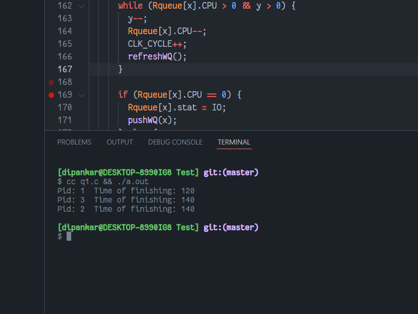
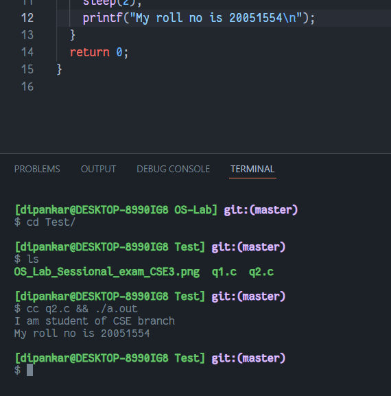

# OS Lab Test
`Author: Dipankar Das`

`Date: 5-5-2022`

`Roll: 20051554`

[Github Link](https://github.com/dipankardas011/OS-Lab)

## Question 1

## Solution

### Q1.c
```cpp
#include <stdio.h>
#include <stdlib.h>


enum state
{
  RUNNABLE,
  RUNNING,
  IO,
  TERMINATED
};

struct proc {
  int pid, CPU, IO;
  enum state stat;
};

struct queue {
  int front, rear;
  int arr[100];
};

struct queue RQ;
struct queue WQ;
static int CLK_CYCLE;
struct proc *Rqueue;
#define No 3
#define Qt 10


void initRQ() {
  RQ.front = RQ.rear = -1;
}

void initWQ() {
  WQ.front = WQ.rear = -1;
}

int isEmptyRQ(){
  return (RQ.front == RQ.rear && RQ.rear == -1) ? 1 : 0;
}

int isEmptyWQ(){
  return (WQ.front == WQ.rear && WQ.rear == -1) ? 1 : 0;
}

void pushRQ(int pid) {
  if (RQ.rear == 99)
    return;
  if (isEmptyRQ())
    RQ.front = 0;

  RQ.arr[++(RQ.rear)] = pid;
}

int popRQ() {
  if (isEmptyRQ())
    return -999;
  if (RQ.rear == RQ.front) {
    int x = RQ.arr[RQ.front];
    initRQ();
    return x;
  }
  return RQ.arr[(RQ.front)++];
}


void pushWQ(int pid) {
  if (WQ.rear == 99)
    return;
  if (isEmptyWQ())
    WQ.front = 0;

  WQ.arr[++(WQ.rear)] = pid;
}

int popWQ() {
  if (isEmptyWQ())
    return -999;
  if (WQ.rear == WQ.front) {
    int x = WQ.arr[WQ.front];
    initWQ();
    return x;
  }
  return WQ.arr[(WQ.front)++];
}

void removeTheDoneProc(int idx) {

  if (idx == WQ.front) {
    // remvoe front
    popWQ();
    return;
  }
  // shifting
  int prevI = 0;
  for (int i = idx; i < WQ.rear; i++)
  {
    WQ.arr[i] = WQ.arr[i+1];
    prevI = i;
  }
  WQ.rear = prevI;
}

void refreshWQ() {
  if (isEmptyWQ())
    return;
  for (int i = WQ.front; i <= WQ.rear; i++)
  {
    if (Rqueue[WQ.arr[i]].IO != 0)
      Rqueue[WQ.arr[i]].IO--;
    
    if (Rqueue[WQ.arr[i]].IO == 0) {
      Rqueue[WQ.arr[i]].stat = TERMINATED;
      printf("Pid: %d\tTime of finishing: %d\n", Rqueue[WQ.arr[i]].pid, CLK_CYCLE);
      removeTheDoneProc(i);
    }
  }
}

int isAllDone() {
  return (Rqueue[0].stat != TERMINATED ||
          Rqueue[1].stat != TERMINATED ||
          Rqueue[2].stat != TERMINATED)
             ? 1
             : 0;
}

int main () {
  Rqueue = (struct proc *)malloc(sizeof(struct proc) * No);

  Rqueue[0].pid = 1;
  Rqueue[0].CPU = 20;
  Rqueue[0].IO = 80;
  Rqueue[0].stat = RUNNABLE;

  Rqueue[1].pid = 2;
  Rqueue[1].CPU = 80;
  Rqueue[1].IO = 20;
  Rqueue[1].stat = RUNNABLE;

  Rqueue[2].pid = 3;
  Rqueue[2].CPU = 20;
  Rqueue[2].IO = 80;
  Rqueue[2].stat = RUNNABLE;

  initRQ();
  initWQ();

  pushRQ(0);
  pushRQ(1);
  pushRQ(2);

  while (isAllDone()) {
    int x = popRQ();
    if (x == -999) {
      CLK_CYCLE++;
      refreshWQ();
    } else {
      int y = Qt;
      Rqueue[x].stat = RUNNING;
      while (Rqueue[x].CPU > 0 && y > 0) {
        y--;
        Rqueue[x].CPU--;
        CLK_CYCLE++;
        refreshWQ();
      }

      if (Rqueue[x].CPU == 0) {
        Rqueue[x].stat = IO;
        pushWQ(x);
      } else {
        Rqueue[x].stat = RUNNABLE;
        pushRQ(x);
      }
    }
  }
}
```

### O/P



## Question 2

## Solution

### Q2.c
```cpp
#include <stdio.h>
#include <unistd.h>
#include <sys/types.h>

int main(int argc, char const *argv[])
{
  pid_t t = fork();
  if (t == 0) {
    printf("I am student of CSE branch\n");
  } else {
    sleep(2);
    printf("My roll no is 20051554\n");
  }
  return 0;
}

```

### O/P

